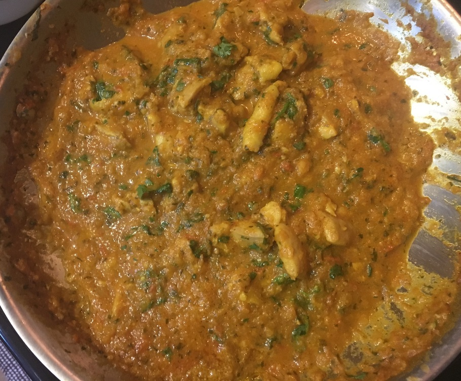

```{r, echo = FALSE, warning = FALSE}
library(tidyverse)
library(RSQLite)
library(knitr)

recipe_name <- 'Ga Chicken Tikka Masala'
connect <- RSQLite::dbConnect(drv = RSQLite::SQLite(), dbname = '../../../data/recipes.db')
ingredients_query <- glue::glue('SELECT * FROM ingredients WHERE recipe = "{recipe_name}"')
instructions_query <- glue::glue('SELECT * FROM instructions WHERE recipe = "{recipe_name}"')
ingredients <- RSQLite::dbGetQuery(conn = connect, statement = ingredients_query)
instructions <- RSQLite::dbGetQuery(conn = connect, statement = instructions_query)
RSQLite::dbDisconnect(conn = connect)

display_ingredients <- ingredients %>%
  dplyr::mutate(idx = ifelse(ingredients == 'any', 1, 0)) %>%
  dplyr::arrange(idx, ingredients) %>%
  dplyr::group_by(recipe, type) %>%
  dplyr::mutate(n = row_number()) %>%
  dplyr::ungroup() %>%
  dplyr::select(-idx) %>%
  tidyr::spread(type, ingredients)
add_cols <- purrr::discard(c('other', 'meat', 'veggie', 'fruit'), ~ .x %in% colnames(display_ingredients))
for(c in add_cols) display_ingredients[,c] <- NA
display_ingredients <- display_ingredients %>%
  dplyr::select(other, meat, veggie, fruit) %>%
  dplyr::mutate_all(~ ifelse(is.na(.x), '', .x)) %>%
  dplyr::rename(Other = other, Meat = meat, Veggie = veggie, Fruit = fruit)

display_instructions <- instructions %>%
  dplyr::arrange(idx) %>%
  dplyr::select(instructions)
```




### Ingredients

```{r, echo = FALSE}
display_ingredients %>% knitr::kable(format = "html", table.attr = "class = \"presenttab\"")
```

<br>

### Instructions

```{r, echo = FALSE}
display_instructions %>% knitr::kable(format = "html", table.attr = "class = \"presenttabnoh\"")
```

